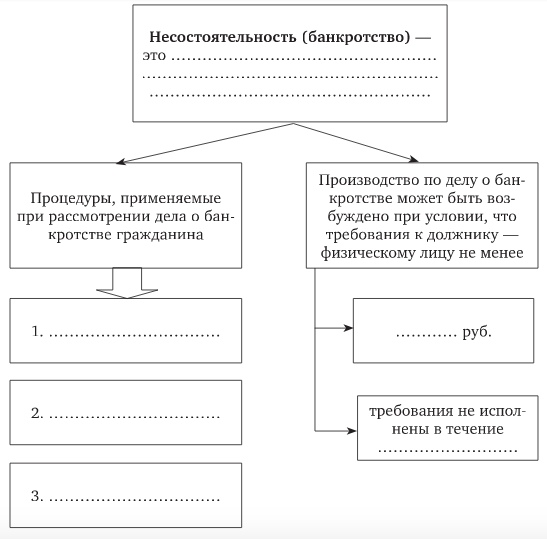

# &rarr; <a id="goToPresentation" target="_blank">Презентация по теме</a> &larr;

# Вопросы

1. Индивидуализирующие признаки гражданина.
2. Понятие и содержание гражданской правоспособности.
3. Гражданская дееспособность и каковы ее виды.
4. Ограничение дееспособности гражданина. Признание гражданина недееспособным.
5. Что представляет собой опека и попечительство? Что такое патронаж?
6. Охарактеризуйте акты гражданского состояния.
7. Что представляет собой безвестное отсутствие гражданина?
8. В чем особенности объявления гражданина умершим?

# Задания

## Задание 1

По учебнику "Гражданское право: учебник: в 4 т. /отв. ред. Е. А. Суханов. - 2-е
изд. перераб. и доп. - Москва: Статут, 2019" подготовить конспект по темам:

- Патронаж над дееспособными (стр. 160-162);
- Безвестное отсутствие гражданина и признание гражданина умершим (стр. 162-166).

## Задание 2

Таблицу заполнить с опорой на Федеральный закон от 26.10.2002 № 127-ФЗ (ред. от
31.07.2020) "О несостоятельности (банкротстве)" (с изм. и доп., вступ. в силу с
01.10.2020).

[Файл с таблицей](./03/Tablitsa.docx)

## Задание 3

Заполните схему:

## Задание 4

Сравните два судебных решения, приведенных ниже. Проанализируйте причины, по
которым суд удовлетворил или отказал в удовлетворении требования о признании
гражданина безвестно отсутствующим.

- [Решение № 2-236/2020 2-236/2020~М-41/2020 М-41/2020 от 26 февраля 2020 г. по делу № 2-236/2020](https://sudact.ru/regular/doc/PCy3tyo2kvJQ/?regular-txt=%D0%BF%D1%80%D0%B8%D0%B7%D0%BD%D0%B0%D0%BD%D0%B8%D0%B5+%D0%B3%D1%80%D0%B0%D0%B6%D0%B4%D0%B0%D0%BD%D0%B8%D0%BD%D0%B0+%D0%B1%D0%B5%D0%B7%D0%B2%D0%B5%D1%81%D1%82%D0%BD%D0%BE+%D0%BE%D1%82%D1%81%D1%83%D1%82%D1%81%D1%82%D0%B2%D1%83%D1%8E%D1%89%D0%B8%D0%BC&regular-case_doc=&regular-lawchunkinfo=&regular-date_from=&regular-date_to=&regular-workflow_stage=&regular-area=&regular-court=&regular-judge=&_=1601573028262&snippet_pos=1070#snippet);
- [Решение № 2-142/2020 2-142/2020(2-9169/2019;)~М-8289/2019 2-9169/2019 М-8289/2019 от 28 февраля 2020 г. по делу № 2-142/2020](https://sudact.ru/regular/doc/sxg7P5jX0Nrj/?regular-txt=%D0%BF%D1%80%D0%B8%D0%B7%D0%BD%D0%B0%D0%BD%D0%B8%D0%B5+%D0%B3%D1%80%D0%B0%D0%B6%D0%B4%D0%B0%D0%BD%D0%B8%D0%BD%D0%B0+%D0%B1%D0%B5%D0%B7%D0%B2%D0%B5%D1%81%D1%82%D0%BD%D0%BE+%D0%BE%D1%82%D1%81%D1%83%D1%82%D1%81%D1%82%D0%B2%D1%83%D1%8E%D1%89%D0%B8%D0%BC&regular-case_doc=&regular-lawchunkinfo=&regular-date_from=&regular-date_to=&regular-workflow_stage=&regular-area=&regular-court=&regular-judge=&_=1601573028262&snippet_pos=554#snippet).

# Задачи

## Задача 1 (ст. 20 ФЗ «Об опеке и попечительстве»)

Субботин Максим 10 лет получил в наследство от бабушки жилой однокомнатный дом,
и предметы домашнего обихода находящиеся в доме. Мать Максима обратилась в
органы опеки и попечительства за получением согласия на продажу дома. В органах
опеки и попечительства отказали в согласии на проведение сделки, так как права
несовершеннолетнего будут нарушены. Против продажи других вещей органы опеки не
возражали. Мать Максима Субботина обратилась в суд с жалобой на действия органов
опеки и попечительства, в которой указывала на то, что она в силу закона
является законным представителем несовершеннолетнего сына и имеет право
совершать от его имени любые действия, в том числе и сделки с недвижимостью.

Оцените действия каждой из сторон? Какое решение должен вынести суд?

## Задача 2

Николай Слепнев после возвращения из армии работал на заводе. Под влиянием
коллег по работе, пристрастился к спиртным напиткам. Родители Николая обращались
за помощью к врачу, принудительно лечили Николая, но как только он приходил на
работу, начинал вновь употреблять спиртные напитки. Родители Николая, обратились
в суд с просьбой об ограничении дееспособности Николая. Отец Николая просил суд
назначить его попечителем.

Назовите условия, при наличии которых возможно ограничение дееспособности лиц,
злоупотребляющих спиртными напитками или наркотическими веществами? Какое
решение вынесет суд?

## Задача 3

В день 16-летия Веронике Абдуловой дедушка с бабушкой подарили дорогие серьги,
украшенные драгоценными камнями. Через год Вероника продала серьги своей подруге
по школе, а на полученные от этого деньги она приобрела себе новый сотовый
телефон. Родители Вероники, узнав об этом, потребовали вернуть украшение, так
как это семейная реликвия. А также они потребовали расторгнуть договор
купли-продажи телефона, так как у Вероники уже есть два телефона и третий ей не
нужен.

Имела ли право Вероника продавать серьги и покупать телефон?

## Задача 4

Света Лазарева, 16 лет, училась в мясомолочном техникуме и получала стипендию в
размере 800 рублей. Большую часть стипендии она тратила на косметику. Света
Лазарева проживала совместно с матерью и двумя малолетними братьями в
двухкомнатной квартире. Мать Светы неоднократно просила ее не тратить деньги на
приобретение косметики, так как семья испытывает определенные материальные
трудности. Мать Светы обратилась с заявлением в мясомолочный техникум, где
училась ее дочь, в котором просила стипендиею ее дочери отдавать ей, так как
Света нерационально тратит деньги. Главный бухгалтер распорядился стипендию
Лазаревой Светы выдавать ее матери.

Правильно ли поступил главный бухгалтер? Предложите Ваше решение проблемной
ситуации.

<!-- ## Задача 5 -->

<!-- Супруги Сибиряковы находились в браке 10 лет, у них родились две девочки. В 2009 г. они развелись, а отец девочек был лишен родительских прав. Несовершеннолетние дочери по решению суда проживают с матерью, которая в 2011 г. поменяла свою и фамилии детей на свою девичью фамилию. Узнав об этом решении, Сибиряков обратился в суд.Проанализируйте данную ситуацию с позиции гражданского законодательства и дайте прогноз развития ситуации в суде. -->

<!-- Может ли единственный законный представитель несовершеннолетнего самостоятельно решать вопрос о смене имени ребенка? Ответ аргументируйте ссылкой на действующие правовые нормы. -->

## Задача 5

Районный суд удовлетворил иск Щекалева о признании его 83-летней матери недееспособной. Утверждая, что у нее старческое слабоумие, истец ссылался на показания свидетелей - соседей, которыми отмечалось, что Щекалева не может понимать значение своих действий и руководить ими. Дело было рассмотрено без участия ответчицы и представителя органов опеки и попечительства.

В апелляционной жалобе Щекалева пояснила, что сын добивается признания ее недееспособной, преследуя цель ограничить ее право распоряжения своим имуществом, так как ему известно, что она намерена завещать имущество внуку. К жалобе приложено заявление внука, в котором он обращает внимание суда на то, что Щекалева вполне разумная женщина, сама себя обслуживает, делает покупки ездит в транспорте. Кроме того, она плохо слышит. Все это и могло создать неверное представление о ее психическом состоянии. При необходимости он согласен осуществлять над ней патронаж.

Какое решение должно быть вынесено апелляционной инстанцией? Не допущено ли судом первой инстанции нарушений при применении норм процессуального законодательства?

# Дополнительно

1. [Заявление об эмансипации](./03/Заявление об эмансипации.pdf)
