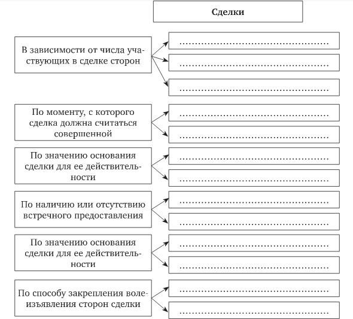
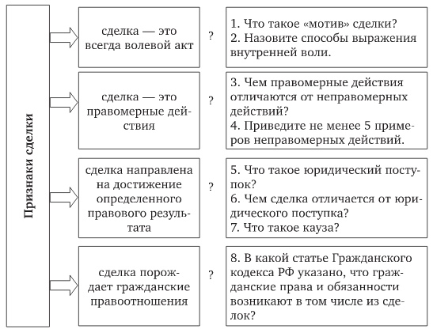
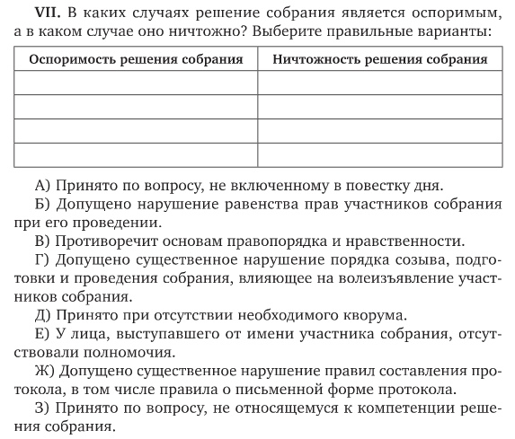
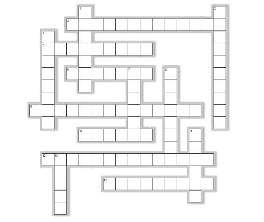
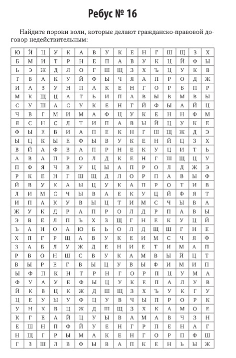

# &rarr; <a id="goToPresentation" target="_blank">Презентация по теме</a> &larr;

# Вопросы

1. Понятие, признаки, цель сделки.
2. Условия действительности сделки.
3. Недействительность сделок (оспоримые и ничтожные сделки).
4. Простая письменная и нотариальная форма сделок, последствия несоблюдения требуемой законом формы сделки.

# Задания

1. Выберите НЕверный вариант(ы) ответа:

   1. любая сделка -- это договор;
   2. любой договор -- это сделка;
   3. любое обязательство -- это сделка.

2. Перечислите случаи, когда ГК РФ предусматривает последствия недействительности сделок в виде:

   1. двусторонней реституции;
   2. односторонней реституции;
   3. неприменения реституции;
   4. возмещение реального ущерба в пользу потерпевшего.

3. Составьте в форме таблицы виды недействительных сделок, указав номер статьи и последствия недействительности сделки:

   1. сделки с пороками содержания;
   2. сделки с пороками субъектного состава;
   3. сделки с пороками воли;
   4. возмещение реального ущерба в пользу потерпевшего.

4. Заполните схему:

   

5. Раскройте признаки сделок:

   

6. Решите:

   

7. Найдите и проанализируйте судебное решение, касающееся притворной сделки: кто предъявил требование в суд относительно притворной сделки, какую сделку прикрывала притворная сделка, благодаря каким фактам судом было установлено, что сделка прикрывает другую сделку?

8. Решите:

   

9. Решите:

   

# Задачи

## Задача 1

На общем собрании жильцов многоквартирного дома было принято решение о сдаче в аренду подвального помещения дома под офис одному юридическому лицу. Однако кворума на собрании жильцов не было.

Вопросы:

1. Каковы правовые последствия принятия на общем собрании жильцов решения о заключении договора, в том числе о сдаче помещения в аренду?
2. Действительно ли решение общего собрания жильцов с учетом условий задачи? Если недействительно, то каковым оно является: ничтожным или оспоримым?

## Задача 2

Определите вид условия в предложенных сделках:

1. Иванов заключил договор с Сидоровым о том, что последний предоставит в июне свою дачу в аренду Иванову, если Иванову будет предоставлен в этом месяце на работе отпуск.
2. Иванов выдаст вексель своей внучке при условии, что она разведется со своим мужем — гражданином Израиля.
3. Профессор решил заняться репетиторством в летнее время и заключил договор с одним неуспевающим студентом о проведении занятий по русскому языку, указав, что, если он (профессор) будет привлечен к работе в вузе в летнее время, то данный договор прекратит свое действие.
4. Один молодой человек сообщил своей девушке, что подарит ей колье, как только ограбит ювелирный магазин.

## Задача 3

Ласточкини его племянник решили порыбачить. Приехав на озеро, Ласточкин купил удочки для рыбной ловли в близлежащем магазине. Однако, когда, устроившись на берегу, они готовились к рыбалке, то обнаружили, что удочки не раздвигаются. Компания отправилась обратно в магазин, чтобы обменять удочки на другие. Продавец попросил представить чек. Пошарив по карманам, Ласточкин с ужасом понял, что чек потерялся. Племянник утверждал, что договор на приобретение удочек был заключен. Продавец магазина возражал против замены удочек, поскольку письменная форма договора не была соблюдена, в связи с чем на свидетельские показания в подтверждение заключения договора ссылаться нельзя.

Вопросы:

1. В какой форме должен быть заключен договор розничной купли-продажи?
2. Назовите общее правило о последствиях несоблюдения простой письменной формы сделки.
3. Прав ли продавец относительно последствий несоблюдения простой письменной формы договора розничной купли- продажи?

## Задача 4

Васечкин с первого взгляда влюбился в Рубашкину и предложил ей выйти за него замуж. Рубашкина подумала неделю и согласилась. Молодые люди пошли в ЗАГС и подали заявление о вступлении в брак. Васечкин очень большое внимание придавал своему внешнему виду и считал, что на свадьбе он должен быть неотразим и обязательно одет в очень дорогой костюм. Жених пришел в элитный магазин одежды и, выбрав костюм, сообщил, что приобретает данный костюм, потому что собирается вступить в брак. Через три недели после приобретения Васечкиным костюма молодые люди поссорились и решили, что не подходят друг другу. Васечкин принес в магазин костюм и сообщил, что возвращает костюм, так как обстоятельство, в силу которого он приобретал костюм, отпало, и костюм ему больше не нужен, просил возвратить деньги.

Вопросы:

1. Имеет ли мотив совершения сделки правовое значение?
2. Подлежит ли требование Васечкина о возврате денег удовлетворению?

## Задача 5

Между больницей и ООО "Сила красоты" был заключен договор о сотрудничестве, согласно которому больница за вознаграждение обязалась передавать организации трупы мертворожденных детей для изучения в целях производства косметических изделий.

Вопросы:

1. Имеет ли данная сделка пороки? В чем существо порока?
2. В каких элементах сделки содержится порок?

## Задача 6

Вспомните сюжет из замечательного произведения Ильфа и Петрова «Двенадцать стульев», когда великий комбинатор Остап Бендер вместе с Ипполитом Матвеевичем Воробьяниновым прибывает в маленький город Васюки. В поисках средств на приобретение стульев, оставшихся на судне, Остап Бендер проводит в шахматном клубе города Васюки лекцию о шахматной мысли и платный шахматный турнир, представляясь гроссмейстером, хотя в шахматы играл только один раз.

Вопросы:

1. Действительна ли сделка, заключенная Остапом Бендером с членами шахматного клуба о проведении шахматного турнира?
2. Если недействительна, то в каком элементе сделки содержится порок и в чем он заключается?
3. В чем отличие между обманом и заблуждением?

- [Информационное письмо Президиума ВАС РФ от 10.12.2013 № 162 «Обзор практики применения арбитражными судами статей 178 и 179 Гражданского кодекса Российской Федерации»](http://www.consultant.ru/document/cons_doc_LAW_157434/b3c0a1fe3622d0bc9c96c4aadf4af5d8b4107fdf/).

## Задача 7

Студенову и Расторгуеву принадлежал на праве общей долевой собственности бревенчатый дом, расположенный на берегу озера Селигер. Между сособственниками сложились неприязненные отношения, и Студенов только с целью навредить Расторгуеву решил продать свою долю очень вредному человеку, с которым далеко не всякий согласился бы жить под одной крышей. Зная, что при продаже доли у Расторгуева как у сособственника дома есть преимущественное право покупки, Студенов договорился с покупателем о заключении договора дарения, при этом получив от него деньги за долю в праве собственности на дом.

Вопросы:

1. В чем различия между притворной и мнимой сделкой?
2. Действителен ли договор дарения? Если недействителен, то в каком элементе сделки содержится порок?
3. Какой договор скрывается за договором дарения? Действительна ли сделка, которая скрывается за договором дарения? Если данная сделка недействительна, какие правовые последствия к ней применяются?

## Задача 8

Сидорова обратилась к организации, оказывающей эзотерические услуги, с просьбой оказать услуги по возврату мужа. Данная организация заключила с Сидоровой договор на оказание данной услуги и взяла плату за услугу в размере 1 млн. рублей. В результате муж не только не вернулся к Сидоровой, но и развелся с ней. Недовольная результатами эзотерических услуг, Сидорова обратилась за юридической консультацией. Юристы юридической компании засомневались в действительности договора. Одни полагали, что имел место обман Сидоровой, другие считали, что данная сделка противоречит основам правопорядка и нравственности, при этом мотивировали свою позицию по-разному: одни обосновывали это тем, что оказание подобного рода услуг противоречит основам правопорядка, другие считали, что недопустимо оказывать на мужа, являющегося третьим лицом, без его ведома и согласия какое-то воздействие.

- [Тресков В.И. Осторожно: мошенничество! Как защитить себя и своих близких. М.: Редакция "Российской газеты", 2018. Вып. 8. 144 с.](./07/О гадалках.docx)

Вопросы:

1. При каких обстоятельствах данный договор может квалифицироваться как договор, заключенный под влиянием обмана? В чем может заключаться обман? В случае, если имел место обман, договор будет являться ничтожной или оспоримой сделкой?
2. Можно ли квалифицировать данный договор как противоречащий основам правопорядка и нравственности.

<!-- ## Задача 9 -->

<!-- Профессор консерватории, обладая скрипкой Страдивари, хотел, чтобы после его смерти скрипка перешла в собственность его талантливого ученика. Зная, что это вызовет неудовольствие членов его семьи, он совершил с учеником в простой письменной форме сделку купли-продажи скрипки. Никаких денег за нее он не получил. Об этом знали два товарища молодого скрипача. После смерти профессора они обо всем рассказали членам его семьи. Наследники потребовали возврата скрипки. Владелец скрипки отказался ее возвратить и предложил наследникам принять у него денежную сумму, указанную в письменном договоре с профессором. Наследники от этого отказались и обратились в суд с иском о возврате скрипки. -->

<!-- Какое решение должен вынести суд? -->
