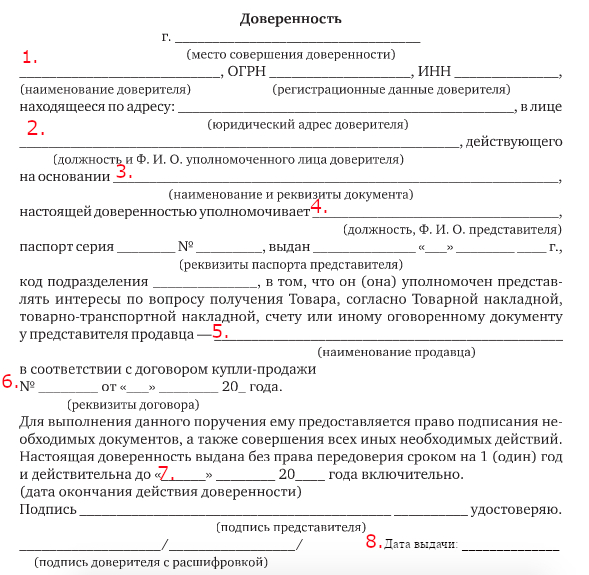

# &rarr; <a id="goToPresentation" target="_blank">Презентация по теме</a> &larr;

<!-- # Вопросы -->

<!-- 1. Понятие и значение представительства. Полномочие и основания возникновения -->
<!--    полномочий. -->
<!-- 2. Отличие представительства от сходных с ним правоотношений. -->
<!-- 3. Понятие и виды доверенности. Обязательные реквизиты. -->
<!-- 4. Срок действия и форма доверенности. -->
<!-- 5. Основания прекращения доверенности. -->
<!-- 6. Каковы цель выдачи и сфера деятельности безотзывной доверенности? -->
<!-- 7. Передоверие. -->

<!-- # Практические задания -->

<!-- ## Задание 1 -->

<!-- По образцу составить доверенность, используя следующие данные: -->

<!-- - представляемый -- ООО «Омторг» -->
<!-- - генеральный директор ООО «Омторг» на основании устава -- Моисеев М.В. -->
<!-- - уполномочиваемое лицо -- начальник юридического отдела Федоров М.П. -->
<!-- - продавец -- ООО «Сибтрейд» -->
<!-- - информация о договоре купли-продажи: -->
<!--   - № Д-0038-КП@ -->
<!--   - от 26.02.2020 -->

<!--  -->

<!-- # Задачи -->

<!-- ## Задача 1 -->

<!-- Акционерное общество «Завод по производству цветной пластмассы» в лице -->
<!-- генерального директора Никодимова Л.О. обратилось к брокеру АО «Центрфинанс» с -->
<!-- предложением заключить в соответствии с Федеральным законом от 21.11.2011 No -->
<!-- 325-ФЗ «Об организованных торгах» договор о брокерском обслуживании по -->
<!-- реализации акций завода на Московской бирже и приобретению на вырученные -->
<!-- средства ценных бумаг иных компаний, имеющих высокую доходность. Условия -->
<!-- соглашения предоставляли брокеру самостоятельный выбор контрагентов завода в -->
<!-- соответствии с поставленными инвестиционными целями. Совершив на бирже ряд -->
<!-- операций по реализации акций завода, брокер приобрел на вырученные средства: -->
<!-- акции банков «Инвестком» и «Восход», облигации ООО «РусСвязь» и векселя -->
<!-- строительной корпорации «Наш дом». Брокер подготовил отчет о расходах на -->
<!-- инвестиционный пакет с приблизительной оценкой его доходности, однако -->
<!-- генеральный директор завода Никодимов Л.О. заявил, что по полученной им -->
<!-- информации АО «Центрфинанс» имеет договоры о брокерском обслуживании с банком -->
<!-- «Восход» и ООО «РусСвязь», а это означает, что он представлял в сделках обе -->
<!-- стороны, что не может не нарушать интересы завода. Вследствие этого завод не -->
<!-- признает действительными сделки, заключенные с банком «Восход» и ООО «РусСвязь», -->
<!-- отказывается выплатить вознаграждение и требует приобрести ценные бумаги у иных -->
<!-- лиц, не состоящих с брокером в коммерческих отношениях. В свою очередь брокер -->
<!-- заявил, что данные сделки совершены правомерно, с учетом целей завода, -->
<!-- приобретенные ценные бумаги отвечают требованиям, которые были предъявлены -->
<!-- клиентом. Генеральный директор завода обратился в арбитражный суд с иском о -->
<!-- признании сделок по приобретению акций банка «Восход» и облигаций ООО «РусСвязь» -->
<!-- недействительными. -->

<!-- **Вопросы:** -->

<!-- 1. Каковы особенности коммерческого представительства? -->
<!-- 2. Может ли коммерческий представитель выступать одновременно от имени двух -->
<!--    контрагентов сделки? -->
<!-- 3. Нарушены ли в данном случае интересы АО «Завод по производству цветной -->
<!--    пластмассы? Какое решение следует вынести суду? -->

<!-- ## Задача 2 -->

<!-- В торговом зале магазина «Все для детей» покупательница Мельникова обратилась к -->
<!-- молодому мужчине, одетому в униформу работника данного магазина с просьбой -->
<!-- помочь выбрать ей подходящий подарок для племянника 4 лет. Полагаясь на -->
<!-- профессиональные знания представителя магазина, она приобрела конструктор, -->
<!-- который оказался сложным для ребенка 4 лет, да к тому же состоял из мелких -->
<!-- деталей, что было опасно. В связи с тем, что упаковка была вскрыта, игрушку -->
<!-- нельзя было обменять в соответствии с законом «О защите прав потребителя» в -->
<!-- течение 14 дней. -->

<!-- Через неделю Мельникова приехала опять в магазин и потребовала заменить игрушку, -->
<!-- так как она была введена в заблуждение работником магазина. Однако в ответ ей -->
<!-- объяснили, что работник, порекомендовавший данный конструктор, был на -->
<!-- испытательном сроке, после окончания которого трудовой договор с ним решено было -->
<!-- не заключать. Поэтому магазин не несет ответственность за действия лица, не -->
<!-- являющегося его работником. К тому же покупательница должна была увидеть на -->
<!-- упаковке игрушки инструкцию, согласно которой данное изделие предназначено для -->
<!-- детей от 8 лет. -->

<!-- Мельникова обратилась за консультацией к юристу. -->

<!-- **Вопросы:** -->

<!-- 1. Возникли ли представительские отношения между магазином «Все для детей» и -->
<!--    лицом, не являвшимся его работником? -->
<!-- 2. Какую консультацию по поводу возникших отношений должен дать юрист? Как -->
<!--    следует разрешить возникший спор? -->

<!-- ## Задача 3 -->

<!-- Общее собрание непубличного акционерного общества по итогам финансового года -->
<!-- решено было провести 2 апреля, однако часть акционеров (четверо из семи) не -->
<!-- могли присутствовать по различным обстоятельствам, в связи с чем на общее -->
<!-- собрание явились их представители. -->

<!-- 2 апреля на общее собрание явились акционеры Федоскин, Уткин и Коноваленко, -->
<!-- владевшие 37% акций общества. Акционер Пантелеев, владеющий 18% акций, находился -->
<!-- на излечении, поэтому его интересы представлял сын Антон, полномочия которого -->
<!-- подтверждались доверенностью, удостоверенной заместителем главного врача -->
<!-- больницы. Акционер Митрохина, владеющая 15% акций, вступившая в состав -->
<!-- акционеров несколько месяцев назад после смерти мужа, написала доверенность на -->
<!-- участие в собрании своего брата, считая, что сама не сможет разобраться. А -->
<!-- интересы сестер Лебедевых, проживавших за границей и владевших оставшейся частью -->
<!-- акций, представлял гражданин Дьяченко, имевший на руках генеральную доверенность -->
<!-- на управление и распоряжение всем их имуществом. -->

<!-- На собрании возник спор по поводу полномочий представителей. -->

<!-- **Вопросы:** -->

<!-- 1. Перечислите основания нотариального удостоверения доверенности. Требуется ли -->
<!--    нотариальное (или приравненное к нотариальному) удостоверение доверенности -->
<!--    для голосования на общем собрании акционеров? -->
<!-- 2. Соответствуют ли предоставленные доверенности требованиям закона о форме -->
<!--    документов, подтверждающих полномочия представителей на общем собрании -->
<!--    акционеров? -->
<!-- 3. Будет ли правомочно общее собрание принимать решение по намеченным вопросам, -->
<!--    если по уставу общества для их решения требуется простое большинство голосов? -->

<!-- **К прочтению:** -->

<!-- - (пп. 7.8, 11.4, 12.2 [Методических рекомендаций по удостоверению доверенностей (утв. решением Правления Федеральной нотариальной палаты 18 июля 2016 г. (протокол № 07/16))](https://www.garant.ru/products/ipo/prime/doc/71398208/)) -->

<!-- ## Задача 4 -->

<!-- Гражданин Анищенко, находясь в длительной командировке за рубежом и получив -->
<!-- хороший гонорар, решил приобрести в России квартиру, для проживания после -->
<!-- возвращения. Договорившись со своим приятелем Коротковым о поиске подходящего -->
<!-- жилого помещения и заключении сделки по его приобретению, Анищенко оформил в -->
<!-- консульстве доверенность на совершение Коротковым всех необходимых действий. В -->
<!-- доверенности не указывалось, выдается она с правом передоверия или без него. В -->
<!-- течение месяца Коротков занимался поиском подходящего жилого помещения, однако -->
<!-- его состояние здоровья резко ухудшилось, и он был госпитализирован. Переживая за -->
<!-- порученное дело, он передоверил действия по поиску и оформлению квартиры своему -->
<!-- знакомому Филиппову. -->

<!-- Филиппов поручение выполнил, квартира была приобретена, однако Анищенко, получив -->
<!-- документы, обратил внимание, что на договоре и иных документах стоит подпись не -->
<!-- Короткова, как представителя покупателя, а Филиппова. Претензий к качеству -->
<!-- жилого помещения у него не имелось, однако он сомневался в действительности -->
<!-- совершенной сделки и волновался, что она может быть оспорена в связи с тем, что -->
<!-- совершена не уполномоченным лицом, так как в доверенности право передоверия не -->
<!-- устанавливалось. -->

<!-- За разъяснением он обратился в юридическую консультацию. -->

<!-- **Вопросы**: -->

<!-- 1. Дайте характеристику основаниям и форме передоверия. -->
<!-- 2. Возможно ли совершить передоверие при отсутствии в доверенности указанного -->
<!--    полномочия? Возможно ли осуществить передоверие, если в доверенности сказано, -->
<!--    что она выдана без права передоверия? -->
<!-- 3. Какие разъяснения следует дать Анищенко в отношении действительности -->
<!--    заключенной сделки по купле-продаже квартиры? -->
