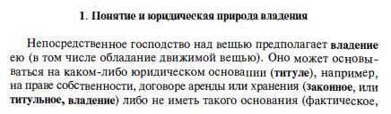
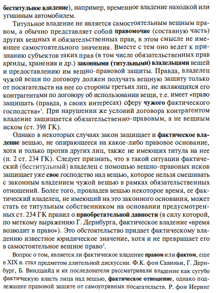
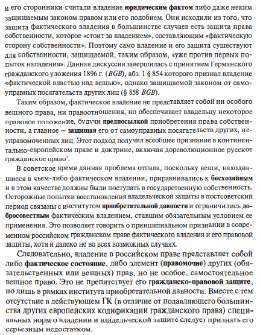
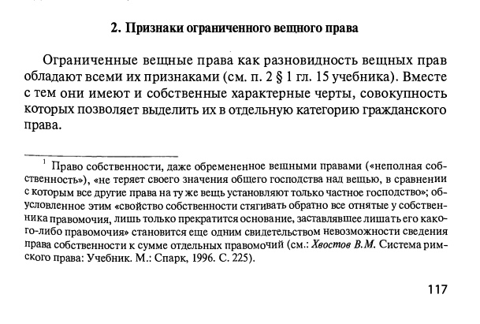
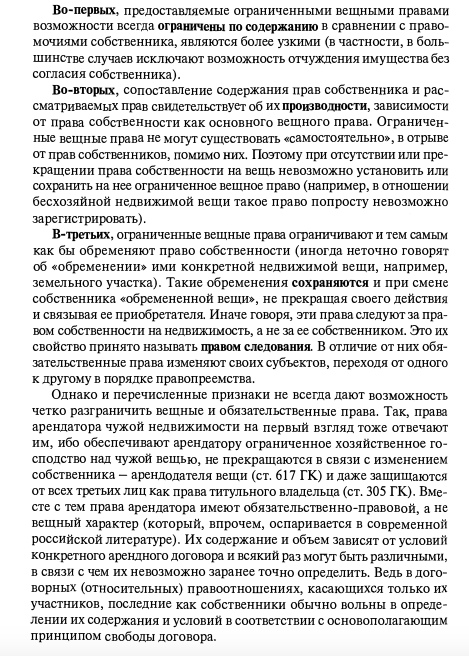
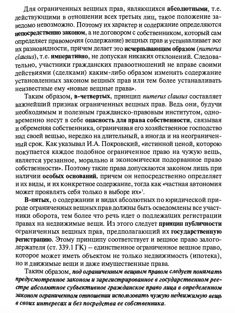

# &rarr; <a id="goToPresentation" target="_blank">Презентация по теме</a> &larr;

# Вопросы

1. Понятие и признаки вещных прав
2. Система вещных прав
3. Содержание права собственности
4. Классификации оснований приобретения и прекращения права собственности
5. Прекращение права собственности
6. Понятие и основания возникновения общей собственности. Общая долевая собственность. Общая совместная собственность.

# Задания

1. [Материал к практическому занятию](./11/eigentum-praktikum.pdf)
2. [Приобретение и прекращение права собственности](./11/p.pdf)
2. [Общая собственность](./11/o.pdf)

# Владение

# Признаки ограниченного вещного права

