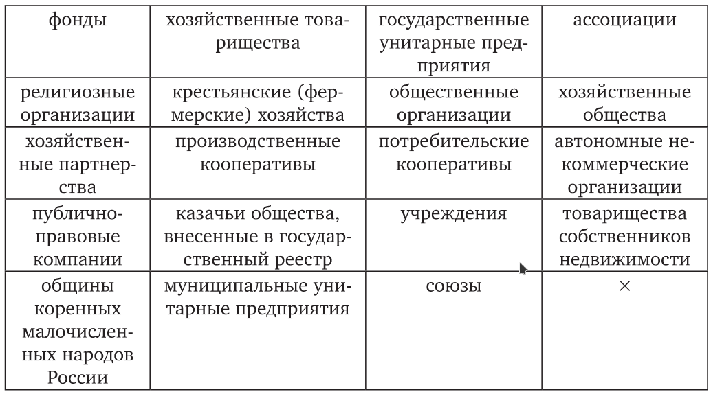
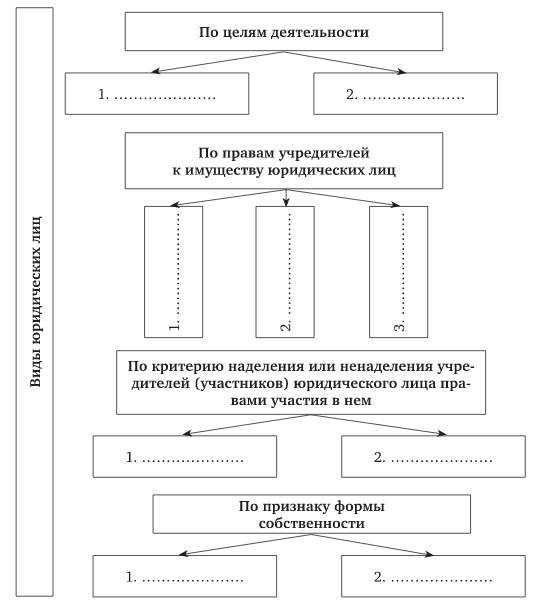

# &rarr; <a id="goToPresentation" target="_blank">Презентация по теме</a> &larr;

# Вопросы для подготовки к занятию:

1. Понятие и признаки юридического лица. Особенности гражданской
   правосубъектности юридических лиц.
2. Теории юридического лица в отечественной науке гражданского права. Общая и
   специальная правосубъектность юридических лиц.
3. Индивидуализация юридического лица.
4. Представительства и филиалы юридических лиц.
5. Классификация юридических лиц.

# Дополнительные источники

1. Курова Н.Н., Юдин Е.В. Анализ теории о природе юридического лица в контексте
   реформирования гражданского законодательства // Юрист. 2015. № 5. С. 4-8 ([ссылка](https://wiselawyer.ru/poleznoe/85962-analiz-teorii-prirode-yuridicheskogo-lica-kontekste-reformirovaniya)).
2. Шульга А.К. Средства индивидуализации юридических лиц: вопросы теории и
   практики // Власть Закона. 2014. № 3. С. 151-160 ([ссылка](./elibrary_22611909_33706796.pdf)).
3. [Постановление](http://base.garant.ru/71100882/) Пленума Верховного Суда РФ от 23 июня 2015 г. № 25 "О
   применении судами некоторых положений раздела I части первой Гражданского
   кодекса Российской Федерации" (п. 21-29).

# Задания

## Задание 1 (ст. 65.2 ГК РФ)

Перечислите права и обязанности участников корпораций.

## Задание 2

Зачеркните юридические лица, которые **не относятся** к унитарным юридическим лицам.

## Задание 3

Заполните схему.

# Задачи

## Задача 1

Для решения задачи необходимо привести необходимые для применения в данной
ситуации [правовые нормы](http://www.consultant.ru/document/cons_doc_LAW_8743/2dde5484151bb43287266805650ce09ee9b973ba/).

В арбитражный суд поступило исковое заявление о признании недействительным
договора, заключенного с участием ответчика – петербургского филиала АО «Тор».
Истец указывал, что АО «Тор» ликвидировано вследствие банкротства более года
назад, о чем он узнал только после заключения договора с его филиалом.

Возражая против иска, директор филиала заявил, что учредившее их АО
действительно ликвидировано, однако имущество филиала по какой-то причине не
было включено в общую конкурсную массу АО, поэтому филиал продолжает
существовать. Кроме того, оспариваемый договор заключен от имени самого филиала,
а значит, никакого обмана контрагента не было. Филиал исправно платит в бюджет
все налоги, вовремя выплачивает работникам зарплату, имеет счет в банке, печать,
следовательно, является полноправным юридическим лицом. Таким образом, нет
никаких оснований для признания договора недействительным.

Кто прав в данном споре?

## Задача 2

В состав учебного института, являющегося негосударственным образовательным
учреждением, входят несколько факультетов, научных лабораторий и учебных
центров. В рамках новой структурной политики руководство института решило
наделить отдельные структурные подразделения правами юридического лица, с тем
чтобы они приобрели финансовую самостоятельность, оставаясь в составе института.

Управление Министерства юстиции РФ усомнилось в возможности существования в
составе одного юридического лица других самостоятельных юридических лиц и
обратилась за разъяснениями к консультанту.

Составьте мотивированное заключение.

## Задача 3

Акционерное общество «Форпост» было реорганизовано путем разделения его на два
самостоятельных предприятия: АО «Старт» и АО «Поиск». Кредиторы общества не были
своевременно уведомлены о реорганизации и узнали о прекращении деятельности АО
лишь из газет. Договоры, заключенные ими с АО, не были исполнены обществом, в
результате чего кредиторы понесли значительные убытки. Правопреемники «Форпоста»
в ответ на претензии кредиторов заявили, что на момент реорганизации никаких
долгов АО перед кредиторами не существовало, поэтому в разделительном балансе
какие-либо обязательства перед кредиторами отсутствуют. Кроме того, за прошедшее
время из состава АО «Старт» выделилось общество «Империал», которое получило
большую часть активов «Старта». Поэтому АО «Старт» не в состоянии возместить
кредиторам убытки, причиненные его правопредшественником. Потерпевшие обратились
к юристу с вопросом о возможных способах защиты их прав.

В каком порядке должна проводиться реорганизация юридического лица? Какие
последствия наступают, если этот порядок нарушен?

## Задача 4

Федоров – участник полного товарищества «Коробкин и компания» – предложил
акционерному обществу заключить выгодную сделку. В подтверждение своих
полномочий на подписание договора Федоров представил:

1. нотариально заверенную копию учредительного договора полного товарищества, из
   которого следует, что Федоров наряду с Коробкиным и фирмой «Вандерлес»
   является его участником, и что ведение дел товарищества поручено Коробкину;
2. доверенность на право совершения соответствующей сделки, выданную Федорову
   фирмой «Вандерлес»;
3. собственноручное письмо Коробкина, из которого видно, что он не возражает
   против заключения договора;
4. визитную карточку, в которой указаны домашний адрес и телефон Федорова.

Подтверждают ли указанные документы полномочия Федорова? Если нет, то какие
документы необходимы для подтверждения его полномочий?

## Задача 5

Министерство юстиции Российской Федерации (далее – Минюст России) обратилось в
Верховный Суд Российской Федерации с заявлением о ликвидации религиозной
организации Западно-Сибирское Объединение христиан веры евангельской
пятидесятников (далее – Религиозная организация), Устав которой зарегистрирован
Минюстом России 29 мая 1996 г., учетный номер 375. В заявлении указано, что в
нарушение положений действующего законодательства Российской Федерации
Религиозная организация не представила в Минюст России документы, содержащие
отчет о ее деятельности, за 2009, 2010 и 2011 гг., в связи с чем в ее адрес 7
июня 2011 г. было вынесено предупреждение, обязывающее устранить выявленные
нарушения в срок до 29 июля 2011 г. Однако до настоящего времени нарушения не
устранены и предупреждение в суд не обжаловано, из чего следует, что
деятельность данной организации осуществляется с грубыми и неоднократными
нарушениями законодательства, которые являются основанием для ее ликвидации в
судебном порядке. В дополнениях к исковому заявлению Минюст России ссылается на
то, что и Устав Религиозной организации противоречит действующему
законодательству, а именно в Уставе Религиозной организации не указаны ее
задачи, пункт 2.2 Устава Религиозной организации содержит открытый перечень
видов деятельности, который она вправе осуществлять, а также Устав Религиозной
организации, именующей себя централизованной организацией (пункт 1.1),
предусматривает возможность вхождения в ее состав (структуру) в качестве
полноправных членов религиозных групп (пункты 2.5, 3.2, 3.3). Кроме того, в
наименовании Религиозной организации нет указаний на её организационно-правовую
форму.

Вопросы к задаче:

1. Что является основанием для ликвидации религиозной организации?
2. Подлежат ли удовлетворению требования Министерство юстиции Российской Федерации?

## Задача 6

Предприниматель, являющийся учредителем юридического лица – общества с
ограниченной ответственностью, направил в адрес Инспекции заказным письмом с
уведомлением заявление о регистрации юридического лица с приложением документов,
необходимых для совершения указанного действия. Рассмотрев полученные 10.04.2011
документы, заместитель руководителя налогового органа в решении от 13.04.2011
отказал в государственной регистрации ООО по причине отсутствия среди названных
документов описи вложения. Посчитав отказ незаконным, Петров обратился с
заявлением в арбитражный суд.

Вопросы к задаче:

1. Назовите основания для отказа в государственной регистрации юридического
   лица.
2. Оцените законность действий налогового органа.
