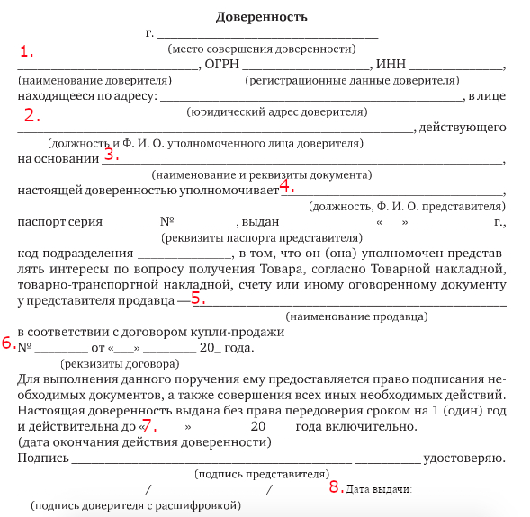

# &rarr; <a id="goToPresentation" target="_blank">Презентация по теме</a> &larr;

# Вопросы

1. Понятие и значение представительства. Полномочие и основания возникновения
   полномочий.
2. Отличие представительства от сходных с ним правоотношений.
3. Понятие и виды доверенности. Обязательные реквизиты.
4. Срок действия и форма доверенности.
5. Основания прекращения доверенности.
6. Каковы цель выдачи и сфера деятельности безотзывной доверенности?
7. Передоверие.

# Практические задания

## Задание 1

По образцу составить доверенность, используя следующие данные:

- представляемый -- ООО «Омторг»
- генеральный директор ООО «Омторг» на основании устава -- Моисеев М.В.
- уполномочиваемое лицо -- начальник юридического отдела Федоров М.П.
- продавец -- ООО «Сибтрейд»
- информация о договоре купли-продажи:
   - № Д-0038-КП@
   - от 26.02.2020

