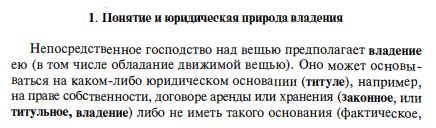
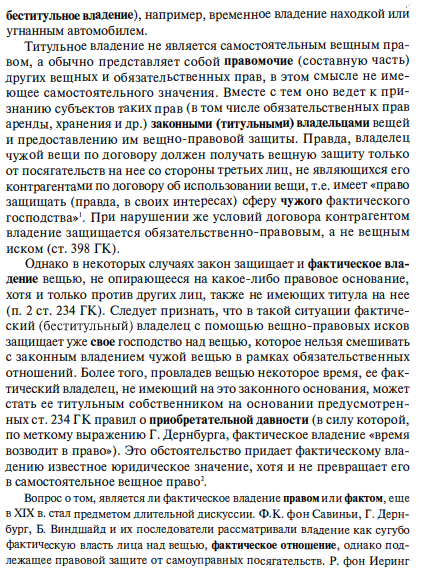
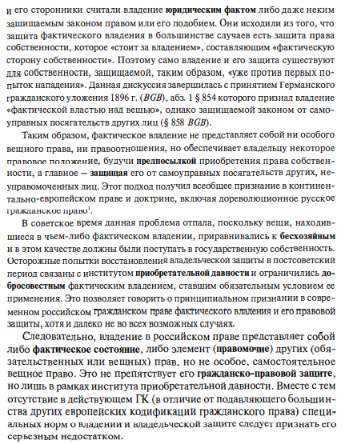

# &rarr; <a id="goToPresentation" target="_blank">Презентация по теме</a> &larr;

# &rarr; [Материал к практическому занятию](./10/eigentum-praktikum.pdf) &larr;

<!-- # Задания -->

<!-- 1. Проанализируйте Постановление Президиума ВАС РФ от 24.12.2013 г. № 12505/13 -->
<!--    по делу № А71-572/2011 и подготовьте сообщение, содержащее следующие блоки: -->
<!--    - описание обстоятельств дела; -->
<!--    - обстоятельства, имеющие значение для разрешения дела, и доказательства; -->
<!--    - содержание принятых по делу судебных актов; -->
<!--    - вывод и значение для правоприменительной практики. -->
<!-- 2. Подготовьтесь к дискуссии по вопросам критики конструкций реальной и -->
<!--    идеальной доли. -->
<!-- 3. Раскройте содержание понятия «общее имущество собственников помещений в -->
<!--    многоквартирном доме» и сравните его с содержанием понятия «общее имущество -->
<!--    собственников комнат в коммунальной квартире». Назовите общие и отличительные -->
<!--    черты режима общей собственности на общее имущество в многоквартирном доме и -->
<!--    общее имущество в коммунальной квартире. -->

# Источники

1. Постановление Пленума Верховного Суда РФ и Пленума Высшего Арбитражного Суда
   РФ от 29 апреля 2010 г. № 10/22 «О некоторых вопросах, возникающих в судебной
   практике при разрешении споров, связанных с защитой права собственности и
   других вещных прав»;
2. Постановление Конституционного Суда РФ от 21 апреля 2003 г. № 6-П «По делу о
   проверке конституционности положений пунктов 1 и 2 статьи 167 ГК РФ в связи с
   жалобами …»;
3. Постановление Конституционного Суда РФ от 22 июня 2017 г. № 16-П «По делу о
   проверке конституционности положения пункта 1 статьи 302 Гражданского кодекса
   Российской Федерации в связи с жалобой гражданина А.Н. Дубовца»;
4. Информационное письмо Президиума Высшего Арбитражного Суда РФ от 13 ноября
   2008 г. № 126 «Обзор судебной практики по некоторым вопросам, связанным с
   истребованием имущества из чужого незаконного владения»;
5. Информационное письмо Президиума Высшего Арбитражного Суда РФ от 15 января
   2013 г. № 153 «Обзор судебной практики по некоторым вопросам защиты прав
   собственника от нарушений, не связанных с лишением владения»;
6. Обзор судебной практики по делам, связанным с истребованием жилых помещений
   от добросовестных приобретателей, по искам государственных органов и органов
   местного самоуправления (утв. Президиумом Верховного Суда Российской
   Федерации 1 октября 2014 г.);
7. Обзор Президиума Верховного Суда России от 25 ноября 2015 г. «Обзор судебной
   практики по делам, связанным с истребованием жилых помещений от граждан по
   искам государственных органов и органов местного самоуправления»;
8. Информационное письмо Президиума Высшего Арбитражного Суда РФ от 28 апреля
   1997 г. № 13 «Обзор практики разрешения споров, связанных с защитой права
   собственности и других вещных прав».
9. Обзор судебной практики по делам об установлении сервитута на земельный
   участок, утвержден Президиумом ВС РФ от 26.04.2017 г.;
10. Обзор судебной практики по делам, связанным с самовольным строительством,
    утвержден Президиумом ВС РФ от 19 марта 2014 г.;
11. Информационное письмо Президиума Высшего Арбитражного Суда РФ от 9 декабря
    2010 № 143 «Обзор судебной практики по некоторым вопросам применения
    арбитражными судами ст. 222 ГК РФ»
12. Постановление Пленума Высшего Арбитражного Суда РФ от 23 июля 2009 г. № 64
    «О некоторых вопросах практики рассмотрения споров о правах собственников
    помещений на общее имущество зданий».

# Владение

# Задачи

## Задача 1

Стрельцов, уезжая в отпуск, отдал свой велосипед Судакову, разрешил пользоваться
им, а в случае поломки велел отремонтировать за свой счет.

Какие правомочия приобрел Судаков? Имеются ли различия в объеме правомочий
Судакова и Стрельцова?

Проанализируйте нормы, регулирующие отношения по договорам аренды, хранения,
перевозки, и укажите, какие правомочия приобретает лицо, которому передается
вещь, сравните их с правомочиями, названными в пп. 1-2 ст. 209 ГК, и
охарактеризуйте их различия.

## Задача 2

Уезжая на месяц в командировку, Васильев оставил часть своих вещей на хранение
Еремеевой. Командировка была продлена на 3 месяца. Возвратившись, Васильев
попросил Еремееву вернуть вещи, но оказалось, что магнитофон поврежден из-за
систематического небрежного использования, а телевизор Еремеева продала, так как
нуждалась в деньгах. При рассмотрении дела в суде Еремеева пояснила, что она
свои действия считает правомерными, поскольку вещи находились у нее на праве
владения, а это право, по ее мнению, неразрывно связано с правами пользования и
распоряжения.

Различаются ли правомочия Васильева и Еремеевой по объему? Сохранились ли
какие-то правомочия у Васильева, когда он передал вещи на хранение? Подлежат ли
требования Васильева удовлетворению, если да, то какие?

## Задача 3

Кооператив «Сервис» взял в аренду дом. Во время капитального ремонта здания при
разборке внутренней стены были обнаружены серебряные и золотые монеты,
украшения, часы в золотой оправе, серебряная кухонная утварь. Известно, что дом
раньше принадлежал купцу. Председатель кооператива считает, что все вещи нужно
сдать государству.

Кому принадлежат найденные предметы? Подлежит ли выплате вознаграждение и если
да, то кому?

## Задача 4

Проживающий с семьей в собственном доме Ильиченко был осужден к 5 годам лишения
свободы с конфискацией имущества. Вскоре после суда его семья переехала в другой
город. Через 2 года Ильиченко был освобожден из-под стражи в связи с отменой
приговора прекращением уголовного дела за отсутствием состава преступления.
Вернувшись, он потребовал возврата дома, который был принят на баланс местной
администрации.

Подлежит ли его требование удовлетворению?

## Задача 5

Комната Огородниковой находится в средней части дома, примыкая с обеих сторон к
комнатам других собственников. Огородникова не пользовалась ею, не отапливала и
не ремонтировала в течение 10 лет, в результате чего та пришла в непригодное для
проживания состояние, что создавало неблагоприятные условия для пользования
домом другими собственниками. Как-то через разбитые окна в комнату проникли
подростки, разожгли в ней костер и чуть не устроили пожар. Соседи обратились к
администрации района с просьбой принять необходимые меры. Администрация вынесла
решение о безвозмездном изъятии у Огородниковой принадлежащей ей части дома как
бесхозяйственно содержимой.

Правомерно ли это решение?

## Задача 6

Общество с ограниченной ответственностью «Нежность» по договору мены приобрело
офисное здание бывшего мебельного комбината «Люрекс». Впоследствии АО «Ласка»,
собственник производственной территории, внутри которой находится здание ООО
«Нежность», установило забор и отказалось без оплаты пропускать внутрь своей
территории.

Каким образом АО "Ласка" может защитить свои интересы? Какие доказательства
могут быть приведены им в обоснование заявленных требований, если АО "Ласка"
изберет юрисдикционный способ защиты права.

Дополнительная информация [тут](./servitut.docx)

## Задача 7

Товарищество собственников жилья обратилось в арбитражный суд с иском к банку об
истребовании из чужого незаконного владения помещения вестибюля, расположенного
на первом этаже многоквартирного дома, и об обязании привести данное помещение в
первоначальное состояние.

В обоснование своих исковых требований истец пояснил, что спорное помещение
является вестибюлем многоквартирного дома, а потому относится к общему имуществу
собственников многоквартирного дома. Банк самовольно занял данное помещение и
безвозмездно использует в своих интересах в качестве офиса, установив в нем
системы кондиционирования, видеонаблюдения, информационное табло, отражающее
курсы валют, а также банкоматы, что в целом повлекло значительное ограничение
доступа других лиц в спорное помещение. Вместе с тем решение общего собрания
собственников многоквартирного дома о предоставлении спорного помещения в
пользование банку не принималось.

Возражая против исковых требований, банк заявил, что является собственником
нежилого помещения в многоквартирном доме, ввиду чего имеет право пользоваться
общим имуществом многоквартирного дома без какого-либо разрешения других
собственников. Кроме того, банк считает возможным и дальше использовать
вестибюль и размещать в нем свое имущество, поскольку именно такой порядок
пользования общим имуществом многоквартирного дома складывался на протяжении
значительного периода времени.

**Вопросы:**

1. Назовите избранные истцом способы защиты гражданских прав.
2. Каким образом собственники помещений в многоквартирном доме владеют,
   пользуются и распоряжаются общим имуществом в многоквартирном доме?
3. Определите обстоятельства, имеющие значение для разрешения спора, а также
   доказательства, необходимые для обоснования позиций истца и ответчика.
4. Подлежат ли удовлетворению исковые требования товарищества собственников
   жилья?

<!-- ## Задача 8 -->

<!-- Администрация города издала постановление об установлении публичного сервитута в -->
<!-- отношении земельного участка с кадастровым номером 55:36:10457:8007, -->
<!-- принадлежащего по праву собственности АО «Ватрушкино», для прокладки силового -->
<!-- кабеля мощностью 10 тыс. кВт, и зарегистрировало данный публичный сервитут в -->
<!-- Росреестре. Реализуя права, предоставленные публичным сервитутом, подрядная -->
<!-- организация проложила путем подземного прокола данный силовой кабель прямо по -->
<!-- диагонали названного земельного участка. -->

<!-- АО «Ватрушкино» потребовало от Администрации города убрать с земельного участка -->
<!-- силовой кабель. Администрация города отказала в удовлетворении предъявленного -->
<!-- требования, мотивируя это тем, что силовой кабель расположен под поверхностью -->
<!-- земельного участка, и поэтому, права юридического лица не нарушаются. Кроме -->
<!-- того, право собственности на земельный участок распространяется только на -->
<!-- поверхность земли, а то, что расположено под поверхностью не является -->
<!-- собственностью организации. На эти отношения распространяется Закон о недрах. -->

<!-- Каким образом защищать свои интересы акционерному обществу? Какие аргументы -->
<!-- следует привести в обосновании своих требований? -->
