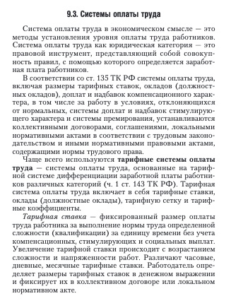
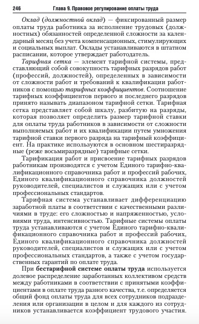
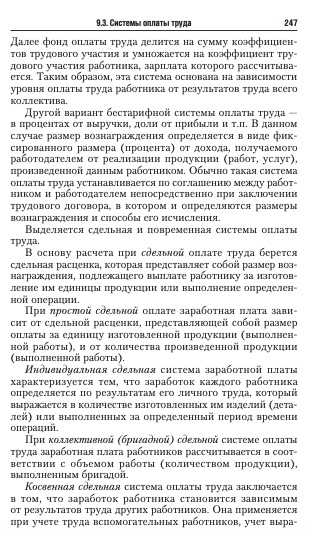
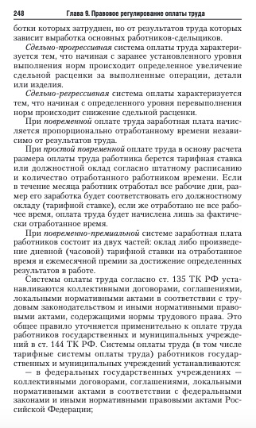
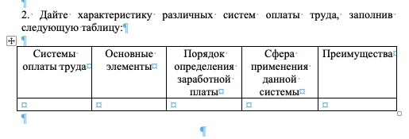

# Материал для занятия

[Системы оплаты труда](./8/Sistemy_Oplaty_Truda_konsultantplyus_2021.docx)

# Тест

1. В течение какого периода производится выплата всех причитающихся работнику сумм в случае его увольнения?

   а. не позднее следующего дня после увольнения;

   б. в день увольнения;

   в. в течение трех дней после увольнения;

   г. в течение месяца после увольнения

2. В течение какого периода производится выплата работнику отпускных?

   а. не позднее чем за один день до начала отпуска;

   б. не позднее чем за 3 дня до начала отпуска;

   в. в первый день отпуска;

   г. в последний день отпуска

3. Каковы сроки выплаты заработной платы?

   а. не реже чем один раз в два месяца;

   б. не реже чем один раз в месяц;

   в. не реже чем каждые полмесяца;

   г. не реже чем раз в неделю

4. Как оплачивается работа в выходные и праздничные дни ( по общему правилу)?

   а. в размере, определяемом соглашением сторон;

   б. не менее чем в полуторном размере;

   в. не менее чем в двойном размере;

   г. в тройном размере

5. Допускается ли компенсация сверхурочных работ предоставлением дополнительного времени отдыха?

   а. нет;

   б. да, по желанию работника;

   в. да, по желанию работодателя;

   г. да

6. Как оплачивается работа в сверхурочное время (по общему правилу)?

   а. в двойном размере;

   б. в полуторном размере;

   в. за первые два часа не менее чем в полуторном размере, за последующие часы не менее чем в двойном размере;

   г. в размере, установленном по соглашению сторон

7. Работникам, занятым на сезонных работах, оплачиваемые отпуска предоставляются из расчета:

   а. три календарных дня за каждый месяц работы;

   б. два календарных дня за каждый месяц работы;

   в. пять календарных дней за каждый месяц работы;

   г. 28 календарных дней

8. Заработная плата начисляется в зависимости от

   а. квалификации работника;

   б. сложности, количества и качества работы;

   в. условий выполняемой работы;

   г. всего перечисленного выше

9. При невыполнении норм труда по вине работника оплата производится:

   а. в соответствии с объемом выполненной работы;

   б. за фактически выполненную работу по пониженным расценкам;

   в. за фактически выполненную работу, но со снижением размера месячной заработной платы;

   г. не производится

10. Верно ли утверждение: заработная плата выплачивается каждые полмесяца для отдельных категорий работников устанавливаются иные сроки:

    а. да;

    б. нет;

    в. частично;

    г. утверждение не предусмотрено действующим законодательством.

11. Стимулирующими не являются

    а. доплаты за совмещение профессий;

    б. доплата работы в условиях труда, отклоняющихся от нормальных;

    в. доплаты при вынужденном переводе на нижеоплачиваемую работу;

    г. выходные пособия.

12. Продолжительность еженедельного непрерывного отдыха не может быть менее:

    а. 42 часов.

    б. 44 часов.

    в. 48 часов.

    г. 50 часов.

13. Работодатель должен предоставить отпуск без сохранения оплаты в следующих случаях:

    а. работающим пенсионерам по старости до 14 календарных дней в году;

    б. работающим инвалидам до 30 календарных дней в году.

    в. работникам в случае регистрации брака до трех календарных дней.;

    г. все перечисленное.

14. При совпадении дня выплаты заработной платы с выходным днем, она производится:

    а. накануне этого дня.

    б. в следующий за выходным рабочий день.

    в. через один день после выходного дня.

    г. через два дня после выходного дня.

15. Заработная плата, излишне выплаченная работнику, может быть с него взыскана в следующем случае:

    а. в связи со счетной ошибкой;

    б. если признана вина работника в невыполнении норм труда по решению КТС;

    в. если имеется простой по вине работника;

    г. все перечисленное.

16. Удержание из заработной платы при отбывании исправительных работ, удержание алиментов на несовершеннолетних детей не может превышать:

    а. двадцати пяти процентов;

    б. тридцати процентов;

    в. пятидесяти процентов;

    г. семидесяти процентов.

17. Время простоя не по вине работника:

    а. не оплачивается;

    б. оплачивается в размере одной трети средней заработной платы;

    в. оплачивается в размере одной второй средней заработной платы;

    г. оплачивается в размере двух третей средней заработной платы.

18. Денежные выплаты, установленные в целях возмещения работником затрат, связанных с исполнением ими трудовых обязанностей – это:

    а. гарантийные выплаты;
    
    б. компенсационные выплаты;

    в. входные пособия;

    г. материальная помощь.

# Задачи

## Задача 1

Инженер Самойлов 5 марта не вышел на работу по неуважительной причине. При получении зарплаты за март он обнаружил, что ему не начислена премия за март, надбавка за стаж работы и не оплачен сам день отсутствия на работе. Самойлов обратился за разъяснениями в бухгалтерию. Как пояснили в бухгалтерии, премия не была начислена в связи с нарушением трудовой дисциплины (хотя по Положению о премировании она установлена за выполнение производственных показателей в течение месяца); надбавка за стаж работы носит стимулирующий характер, следовательно, Самойлов не имеет на нее права в связи с прогулом, а день прогула не оплачен, потому что он не отработал этот день и не выполнил норму рабочего времени. Самойлов возражал, так как, по его мнению, за нарушение трудовой дисциплины к нему могли применить только меры дисциплинарного взыскания, предусмотренные ст. 192 ТК РФ

Каково Ваше мнение по поводу сложившейся ситуации?

## Задача 2

Тополев работает в АО «Сплит» и является почетным инженером АО «Сплит». Его заработная плата складывается из оклада, доплаты за работу во вредных и опасных условиях труда, стимулирующих выплат, предусмотренных Положением о премировании, а также районного коэффициента.

В соответствии с Положением о премировании АО «Сплит» работникам, отвечающим условиям премирования, надлежит выплачивать ежемесячные надбавки. Одной из таких надбавок является надбавка за присвоение почетного звания.

Однако за период с января по февраль Тополеву не была выплачена стимулирующая надбавка за присвоение почетного звания. Руководитель АО «Сплит» пояснил, что указанная надбавка относится к переменной части заработной платы и может не выплачиваться по усмотрению руководства общества.

1 марта Тополев направил почтовым отправлением в АО «Сплит» уведомление о приостановлении работы на весь период до выдачи невыплаченной суммы заработной платы и не вышел на работу. Уведомление в АО «Сплит» поступило 5 марта.

В установленные для выплаты заработной платы дни заработная плата Тополеву не была выплачена, в связи с чем он обратился в суд с иском о взыскании невыплаченной надбавки, процентов за просрочку выплаты заработной платы, а также средней заработной платы за время приостановления работы.

В суде представитель работодателя пояснил, что выплата стимулирующих надбавок не является в силу трудового законодательства обязательной, поэтому может не производиться по решению руководства; в период с 1 марта по 4 марта Тополевым совершен прогул, так как работник отсутствовал на работе без уважительной причины, а срок приостановления работы исчисляется с момента, когда работодатель был уведомлен, т.е. с 5 марта. Также представитель работодателя указал, что с 5 марта Тополевым приостановлена работа, в указанный период он по своей инициативе не выполнял трудовые обязанности, в связи с чем нет оснований для выплаты ему средней заработной платы.

Решите дело.

## Задача 3

Получив расчетный листок при очередной выплате заработной платы, менеджер по поставкам продукции ЗАО «Экосистемы» Петраков обнаружил, что с него удержано 33% заработной платы. Петраков обратился в бухгалтерию ЗАО, где ему пояснили, что в предыдущие два месяца вследствие счетной ошибки ему были выплачены излишние суммы, а сейчас они с него взысканы. Посмотрев сделанные бухгалтерией расчеты,

Петраков против оснований и размеров удержания не возражал, но заявил, что взыскание с него сразу более чем 30% заработной платы «подорвет его семейный бюджет».

Правомерны ли действия администрации ЗАО «Экосистемы»? Какой порядок и размер удержаний из заработной платы установлены действующим законодательством?

## Задача 4

Руководитель недавно созданного ООО «Салют» Никоненко предложил своему знакомому Трифонову поработать у него бухгалтером. Когда Трифонов пришел в необорудованный офис ООО, он выяснил, что реально в фирме пока работают двое: Никоненко и офис-менеджер Ирина, которая принимает звонки по телефону. Штат фирмы пока не сформирован, однако вести бухгалтерский учет необходимо, поэтому Трифонову было предложено приступить к работе. Трифонов проработал в ООО «Салют» более месяца, однако его прием на работу никто оформлять не собирался. На вопрос о выплате Трифонову заработной платы Никоненко отвечал, что наличных денег пока нет и нужно подождать, когда деятельность фирмы развернется в полном объеме.

Трифонов обратился к адвокату за разъяснениями, имеет ли он право подать заявление в суд о взыскании оплаты выполненной им работы, поскольку бухгалтерский отчет за месяц он оформил и сдал в налоговые органы, а также оформлял иные текущие бухгалтерские документы, на которых есть его подпись.

Дополнительные вопросы:

1. Понятие и значение среднего заработка.
2. Оплата времени простоя.

## Задача 5

Иванов трудоустроился на должность бухгалтера в ПАО «Эр-Телеком» год назад. Подошла его очередь идти в отпуск. Оклад составляет 15000 руб. С 01.04 по 15.04 находился в командировке. С 01.06 по 31.07 находился на больничном. Каждый месяц помимо оклада получал оплату питания и проезда в размере 1000 руб., в августе ему выплатили материальную помощь в размере 2000 руб., в сентябре выплатили премию в размере 5000 руб.

Рассчитайте сумму отпускных Иванова, используя нормы ТК РФ и Постановление Правительства РФ от 24.12.2007 N 922 (ред. от 10.12.2016) "Об особенностях порядка исчисления средней заработной платы"